# Настройка интеграции Notion и GitHub с помощью Zapier

## Подробнее о Zapier

[Zapier](https://zapier.com/app/dashboard) - это платформа, которая связывает различные приложения и автоматизирует повторяющиеся задачи в рамках рабочего процесса. Данный сервис позволяет настроить обмен данными между приложениями по заданной инструкции. **Триггер** (trigger), т.е. заданное событие в одном из связанных приложений, запускает **действие** (action), т.е. ожидаемое событие в другом связанном приложении. Путь, который данные пользователя проходят в рамках такого процесса, называется Zap. 

В зависимости от того, каким образом настроена интеграция, одно из приложений становится истоником события-триггера, а другое приложение (или ряд приложений, если данные проходят через несколько узлов в рамках интеграции) выполняет действие.  Zapier позволяет настроить интеграцию между системой управления знаниями [Notion](https://www.notion.so/) и сервисом для хранения кода [GitHub](https://github.com/), используя те возможности, которые предоставляют API этих платформ. 

Например, в Notion с помощью Zapier можно настроить один триггер - создание нового элемента в [базе данных](https://www.notion.so/Intro-to-databases-fd8cd2d212f74c50954c11086d85997e) - и два действия: создание нового элемента в базе данных и обновление уже существующего элемента. Кроме того, доступны два промежуточныx действия: поиск нужного элемента базы данных и поиск [страницы](https://www.notion.so/Create-a-new-page-6c3fe9aad94749099ea4bdfc072e5f97).

В GitHub можно настроить целый ряд триггеров: создание нового репозитория, ветки, пулреквеста, комита и др. Что касается действий, GitHub дает возможность создавать или обновлять пулреквесты, issue, удалять ветки и др., а также выполнять промежуточные действия поиска по репозиториям, пулреквестам, пользователям, организациям и др.

Полный список [поддерживаемых возможностей](https://zapier.com/apps/notion/integrations/github#triggers-and-actions) представлен на странице интеграции.

Самый популярный в Zapier сценарий интеграции Notion и GitHub выглядит так: когда в определенную базу данных в Notion добавляется новый элемент, в соответствующем репозитории на GitHub автоматически создается новое issue.

## Предварительная настройка

Чтобы зарегистрироваться в Zapier, нажмите на кнопку *Sign up* на [главной странице сайта](https://zapier.com/)

Прежде чем начать настройку интеграции, создайте базу данных в Notion, из которой будут запускаться события-триггеры. Для этого нажмите на иконку *New page* в левом нижнем углу интерфейса Notion:

Выберите *Table* в разделе *DATABASE*:

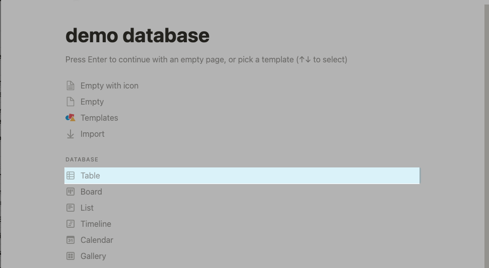

Выберите *New database* в меню справа:

Нажмите на +, чтобы создать дополнительный столбец *Issue body*, который будет отвечать за текст комментария к создаваемому issue:

В поле *Type* для этого столбца выберите значение *Text*:

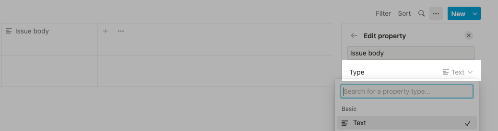

В графу *Tags* вы можете добавить варианты ярлыков, которые будут отображаться как *Labels* в тикете issue на GitHub: 

## Настройка интеграции 

Чтобы настроить эту интеграцию, удостоверьтесь, что на [странице интеграции Notion и GitHub](https://zapier.com/apps/notion/integrations/github) в графе *When this happens...* выбрано **New Database Item**, а в графе *automatically do this!* выбрано **Create Issue** и нажмите на *Connect Notion + GitHub*:

На открывшейся странице выберите кнопку *Get started*:

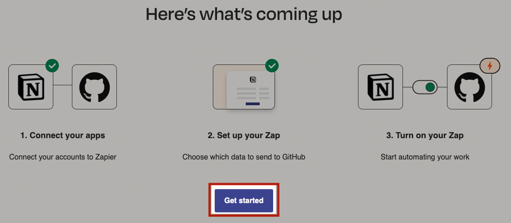

Следующий шаг - подключение аккаунта Notion. Нажмите на *Connect*:

После переадресации на страницу предоставления доступа к Notion, ознакомьтесь с деталями доступа к своему аккаунту. Если вы согласны продолжить, нажмите на *Select pages*: 

В открывшемся меню выберите созданную ранее базу данных и нажмите на *Allow access*:

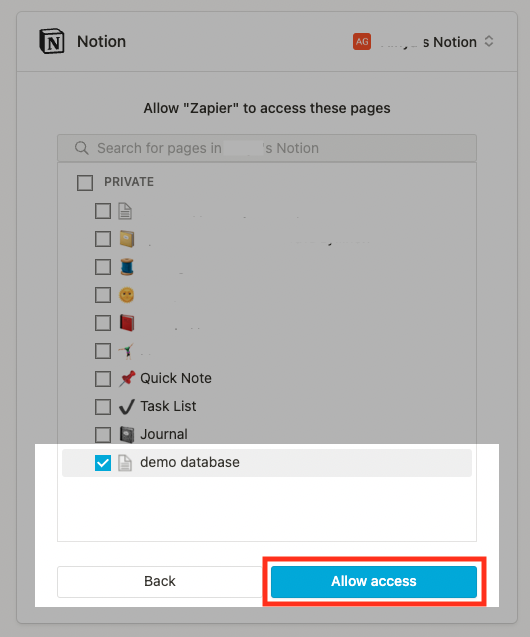

Вернитесь на предыдущую вкладку. После авторизации подключение аккаунта будет подтверждено зеленой галочкой. Чтобы продолжить, нажмите на *Next*:

Подтвердите выбор базы данных, затем нажмите на *Next*:

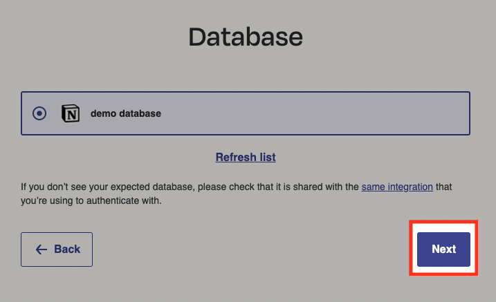

Далее подключите аккаунт GitHub к Zapier, нажав на *Connect*:

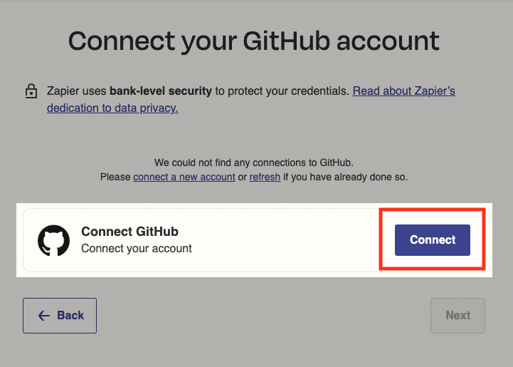

После переадресации на страницу авторизации в GitHub, ознакомьтесь с деталями предоставления доступа к своему аккаунту. Если вы согласны продолжить, нажмите на *Authorize zapier*: 

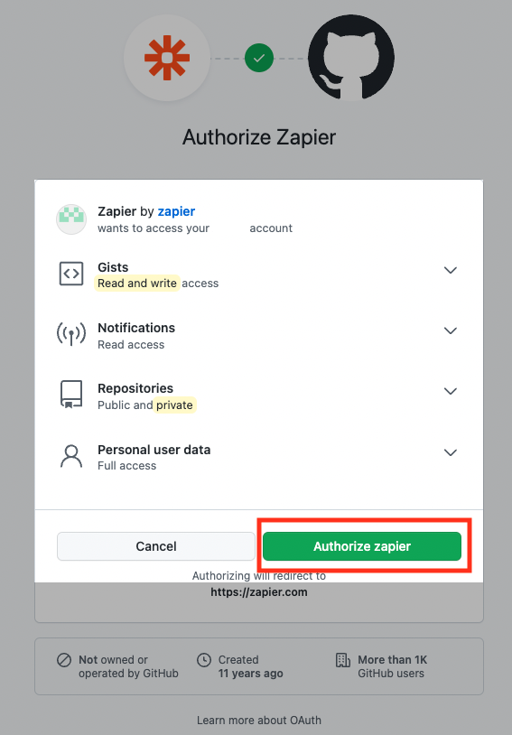

На [странице авторизации в GitHub](https://github.com/login/oauth/authorize) введите пароль от своего аккаунта:

После авторизации подключение аккаунта будет подтверждено зеленой галочкой. Чтобы продолжить, нажмите на *Next*:

Выберите репозиторий, который необходимо подключить к интеграции, и нажмите на *Next*:

Открывшийся редактор интеграции не позволяет задавать значение *Labels* через столбец *Tags* в базе данных. Чтобы настроить эту функцию, перейдите в продвинутый режим редактирования, нажав на *See how the Zap editor can help you*:

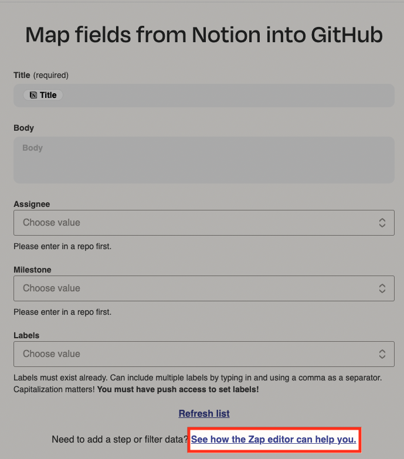

Нажмите на кнопку *Use advanced mode* в открывшемся окне:

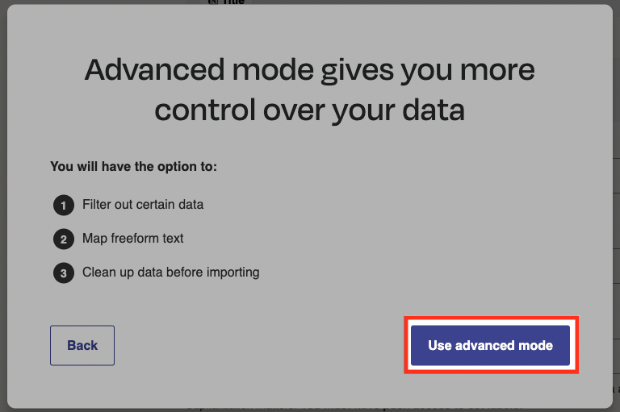

Откройте второй шаг интеграции (*Action*) и выберите *Set up action*:

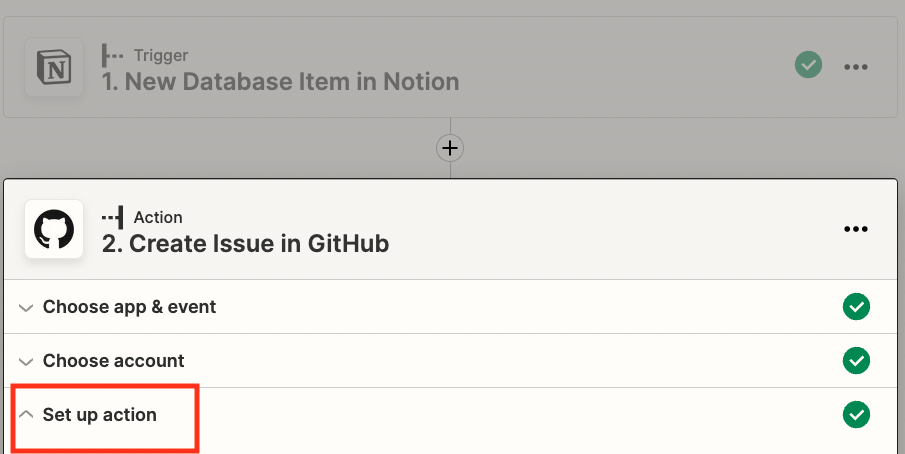

В графе *Title* по умолчанию выставлено значение **Title**, оставьте эту графу без изменений. В графе *Body* выберите значение **Issue body**:

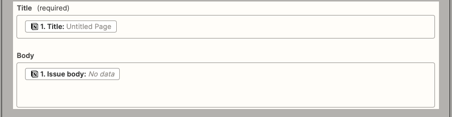

В графе *Labels* выберите меню *Custom*, затем выберите из списка значение *Tags*:

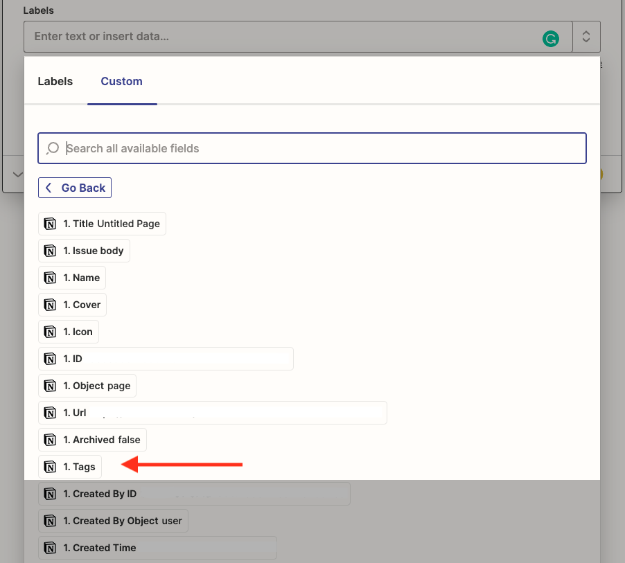

Нажмите на *Continue*. В открывшемся разделе *Test action* нажмите на *Test & continue*:

В вашем репозитории, подключенном к интеграции, должно появиться тестовое issue *Untitled Page*. Если это произошло, значит, интеграция подключена правильно. Нажмите на *Publish Zap*. В открывшемся окне выберите *Publish & Turn On*, чтобы включить созданную автоматизацию:

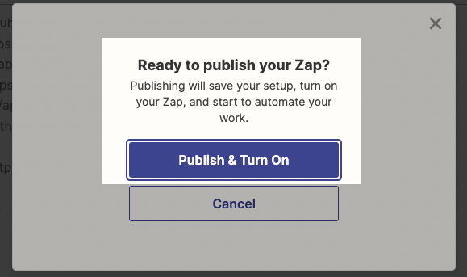

Интеграция готова. Обратите внимание, что в таблицах Notion по умолчанию создаются три пустых строки. Когда вы заполняете эти три строки, интеграция не работает. Чтобы отправить issue в GitHub, создавайте новую строку с помощью кнопки *New* в правом верхнем углу таблицы или под уже созданными столбцами:

Чтобы протестировать автоматизацию самостоятельно, создайте новые элементы в подключенной базе данных. В течение нескольких минут они должны появиться в виде новых issue в вашем репозитории.

